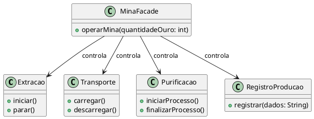

# Facade

## Motivação

Imagine que você está desenvolvendo um sistema para gerenciar uma mina de ouro. Esse sistema envolve várias operações, como extração do minério, transporte, purificação e registro da produção. Cada uma dessas operações possui sua própria lógica interna e expõe diferentes métodos para serem utilizados.

### Problema:

- **Alto Acoplamento:** O cliente precisa interagir diretamente com diversas classes, tornando o código mais complexo e difícil de manter.
- **Dificuldade de Uso:** Como há várias classes com métodos distintos, é necessário um conhecimento profundo de cada uma delas para operar corretamente a mina.
- **Baixa Manutenibilidade:** Qualquer alteração nas classes internas pode impactar diretamente a forma como o cliente interage com o sistema.

## Como o Facade Resolve o Problema

O padrão **Facade** fornece uma interface simplificada para um conjunto de classes complexas. Ele age como um intermediário, agrupando chamadas e ocultando detalhes internos, tornando o código mais simples e organizado.



## Estrutura

- **Facade (MinaFacade):** Proporciona uma interface simplificada para interagir com o sistema da mina de ouro.
- **Subsistemas:**
  - **Extracao:** Responsável pelo processo de extração do minério.
  - **Transporte:** Lida com o carregamento e descarregamento do minério.
  - **Purificacao:** Gerencia a purificação do ouro extraído.
  - **RegistroProducao:** Mantém registros sobre a produção.

## Participantes

- **Facade (MinaFacade):** Fornece um ponto de acesso único para os clientes utilizarem os serviços do sistema.
- **Subsistemas (Extracao, Transporte, Purificacao, RegistroProducao):** Executam a lógica interna de cada etapa da produção de ouro.

## Exemplo de Código em JavaScript

```javascript
class Extracao {
    iniciar() {
        console.log("Máquinas de extração iniciadas...");
    }

    parar() {
        console.log("Máquinas de extração desligadas...");
    }
}

class Transporte {
    carregar() {
        console.log("Caminhões carregados com minério...");
    }

    descarregar() {
        console.log("Minério descarregado na purificação...");
    }
}

class Purificacao {
    iniciarProcesso() {
        console.log("Processo de purificação do ouro iniciado...");
    }

    finalizarProcesso() {
        console.log("Ouro purificado e armazenado...");
    }
}

class RegistroProducao {
    registrar(dados) {
        console.log(`Registro de produção: ${dados} kg de ouro processados.`);
    }
}

// Facade
class MinaFacade {
    constructor() {
        this.extracao = new Extracao();
        this.transporte = new Transporte();
        this.purificacao = new Purificacao();
        this.registro = new RegistroProducao();
    }

    operarMina(quantidadeOuro) {
        this.extracao.iniciar();
        this.transporte.carregar();
        this.transporte.descarregar();
        this.purificacao.iniciarProcesso();
        this.purificacao.finalizarProcesso();
        this.registro.registrar(quantidadeOuro);
        this.extracao.parar();
    }
}

// Cliente utilizando a Facade
const mina = new MinaFacade();
mina.operarMina(50);
```

## Benefícios do Padrão Facade

✔ **Redução do Acoplamento:** O cliente interage apenas com a classe Facade, sem depender diretamente das classes internas.
✔ **Código Mais Limpo:** O cliente não precisa conhecer os detalhes internos das operações.
✔ **Facilidade de Manutenção:** Mudanças nos subsistemas não afetam diretamente o cliente, desde que a interface da Facade permaneça a mesma.
✔ **Maior Reutilização:** A classe Facade pode ser utilizada em diferentes partes do sistema, promovendo reuso de código.

### Conclusão
O padrão Facade é ideal para simplificar a interação com sistemas complexos. No exemplo da mina de ouro, ele encapsula as operações internas, oferecendo uma única interface para gerenciar toda a produção, facilitando a manutenção e o uso do sistema.

